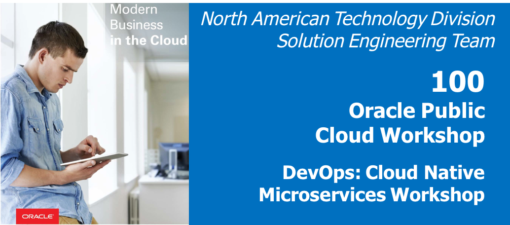

  
Updated: November 15th, 2018

## Introduction

This is the first of several labs that are part of the **Oracle Integrating Oracle DevCS with external Jenkins Server and IntelliJ IDE.** 

## Objectives
- Create Instances
    - Create a project
- Create a new repository

### Create an Autonomous Developer Cloud Service instance:
* Go to [Oracle Cloud Service](https://cloud.oracle.com/home) homepage.

* Create an __Autonomous Developer Cloud Service Instance__

* Click on the instance's hamburger menu and then click on __Access Service Instance__

* Create a __Project__ within your Autonomous Developer Cloud Service instance.

* Go to the code section on the lefthand side and click on __create a new repository__.

* __Name__: CodeRepo
* Click __Import existing repository__
* __Import existing repo__: https://github.com/blakeramos/JavaWebApp

