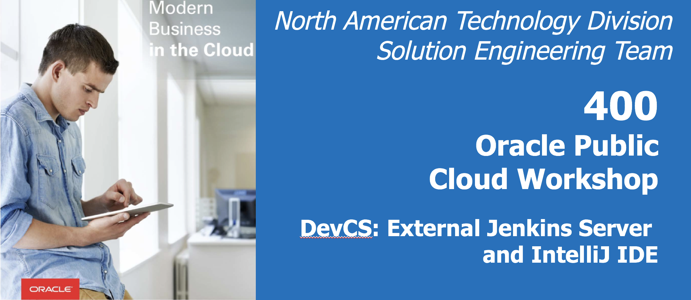

  
Updated: November 15th, 2018

## Introduction

This part of the lab will help you create and configure the webhooks that will allow our external Jenkins server and Oracle Autonomous Developer Cloud project to communicate. __Congrats! You are almost done!!!!!__

## Objectives

- Configure Webhooks
- Track Builds

## Required Artifacts

- List of Prerequisites

# Lab: 400
This part of the lab will help you create and configure the webhooks that will allow our external Jenkins server and Oracle Autonomous Developer Cloud project to communicate. 
## __Congrats! You are almost done!!!!!__
### **STEP 1**: In Oracle Autonomous Developer Cloud Service interface, open the project, and click __Administration --> Webhooks__ in the side bar.

  * Click __+ New Webhook__
    * __Type__: Select __Hudson/Jenkins - Build trigger__
    * __Name__: Enter __JenkinsBuildWebhook__ 
    * __Build Server Url__: Your jenkins URL: (eg: http://username.localhost.run)
    * __Job name__: __AutoDevCS_JavaApp__
    * __Build Server Security__: Select __Build Token Root Plugin__, the build will be triggered only if the Build Authorization Token Root plugin is installed on the Jenkins server. 
    * __Remote Build Token__: my_auth_token, the same token name that was specified in the Jenkins job.
    * __Repository__: The repository you made in Oracle Autonomous Developer Cloud Service. 
    * Click __Done__
    
    
  * Select the webhook you just created and click __Test__
  If the configuration is correct you will see a green check mark. If it is not there will be a red x and you will need to go into the logs to debug. Once you see the green check mark, your webhook is ready to send a notification to the Jenkins server to run a build when any update is pushed to the specified Git repo.
  
  * In the webhooks page, click __+ New Webhook__
    * __Type__: Select __Jenkins - Notification Plugin__
    * __Name__: Enter __JenkinsGetNotification__ 
    * __Base Url__: Your jenkins URL: (eg: http://username.localhost.run)
    * Check the box that says __Ongoing Builds__ 
    * Click __Done__
    The webhook is now able to get notification from the Jenkins server when the build runs and is complete.
    

### **STEP 2**: Copy the __JenkinsGetNotification__ webhook __URL__ (if you look at the picture above. That URL with the "HTTP" box beside it is the one you need to copy.)
  * Now go back to your __Jenkins server__. Open the __configure__ page for your job.
  * Click on the __Job Notifications__ tab
  * Select __Add Endpoint__
    * In the __URL__ field paste the JenkinsGetNotification webhook URL that you copied earlier. 
    * You __DO NOT__ have to change any other fields.
  * Select __Save__
  
  
### **STEP 3**: Now your Autonomous Developer Cloud Service and Jenkins server are ready to send and recieve notifications. 
* Go to your Autonomous Developer Cloud Service, on the side bar select __Code__
  * Go into the directory and change the output in __Index.jsp__
  * To do so, there is a pencil icon that allows you to update your code within Autonomous Developer Cloud Service. 
  * Click __Commit__ (Enter a commit message)
  
  
* Go to the side bar and click project.
  * You should see a notification that you have pushed your code to the master.

* Go to your Jenkins server
  * On the main page you should see a build happening under __Build Executor Status__. The initial build may take some time to complete. If the build does not succeed you can select your Job and the specific build. In the build there is a log that you can read to debug if necessary. 

When the build is running, if you go back to your Autonomous Developer Cloud Service project.
* Go to __Projects__
* You should see that a __Tracked Build__ is running. 
  * Once the build succeeds you will see a __Build Success Notification__
  
When the build is complete, if you go back to your Autonomous Developer Cloud Service project.
* Go to __Projects__
* You should see that a __Tracked Build__ has ended with the status: __Success__. 

Oracle Autonomous Developer Cloud Service Project notifications

Jenkins Server View (when building):

### **STEP 4**: With a successful build, go back to the Jenkins server.
* In the __Build__ page of your __Job__.
* You can now download the __build artifact__ and __deploy__ it to your server or on Oracle Java Cloud Service.

# What next???!!?!?!
* [Deploying a Java EE application to a Java Cloud Service Instance](https://www.oracle.com/webfolder/technetwork/tutorials/obe/cloud/javaservice/JCS/eclipse_jcs/eclipse_jcs.html)
* [Deploying a Jenkins server on OCI](https://blogs.oracle.com/cloud-infrastructure/deploy-jenkins-on-oracle-cloud-infrastructure) 
